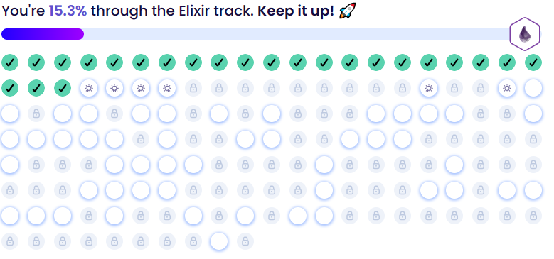

# ElixirLearningExercises


Exercises I solved, on the Exercism platform, it's great for learning a new programming language.
There you can solve the problems and you can see the solutions made by other people.

[Brendon3578's Exercism Profile](https://exercism.org/profiles/Brendon3578)

[Exercism - Elixir track](https://exercism.org/tracks/elixir)

<center>
  <h3>Checkout my percentage of exercises done.</h3>

</center>


## Installation

```bash
# Install elixir dependencies
mix deps.get
```

